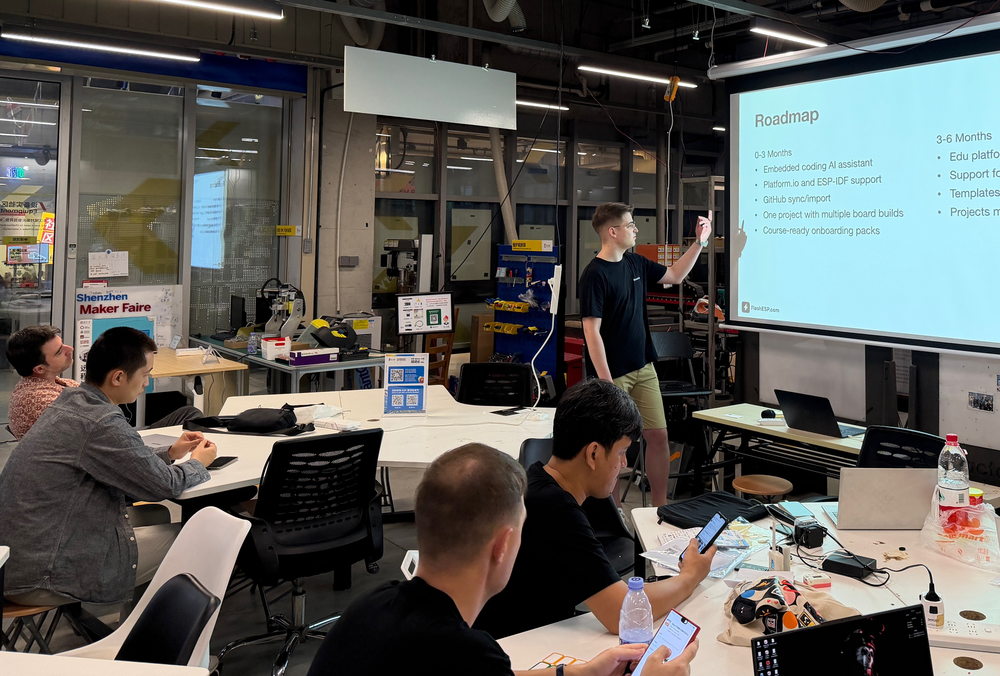

# FlashESP Community

Welcome! This repository is the official place to **report bugs**, **request features**, and **share ideas** for **FlashESP**.

If you’re using FlashESP and something doesn’t work as expected — or you have an idea that could make the app better — you’re in the right spot.

## What this repo is for
- 🐛 Bug reports
- ✨ Feature requests
- 💡 Product & UX suggestions
- 📚 Documentation improvements
- ❓ Questions (if they don’t fit elsewhere)

## Before creating an issue
1. **Search existing issues** to avoid duplicates.
2. Use a clear title and include as much context as you can.

## Creating a good bug report
Please include:
- FlashESP version (or commit/build info)
- Your browser and ESP version
- Steps to reproduce the issue
- Expected vs actual behavior
- Logs/screenshots (if available)

## Feature requests & ideas
When suggesting something new, try to answer:
- What problem does it solve?
- Who benefits from it?
- Any proposed UI/flow or examples?

## Roadmap

Here is the roadmap presented during the FlashESP launch at Maker Faire Shenzhen 2025:

## Labels & triage
Issues may be labeled for easier tracking, e.g.:
- `bug`, `enhancement`, `question`, `good first issue`, `needs info`

## Contributing
At the moment, this repository is focused on issue tracking and discussion.  
If/when code contributions are opened, contribution guidelines will be added here.

## Code of Conduct
Be respectful and constructive. We’re building FlashESP together with the community.

---

Thank you for helping improve FlashESP! 🚀
